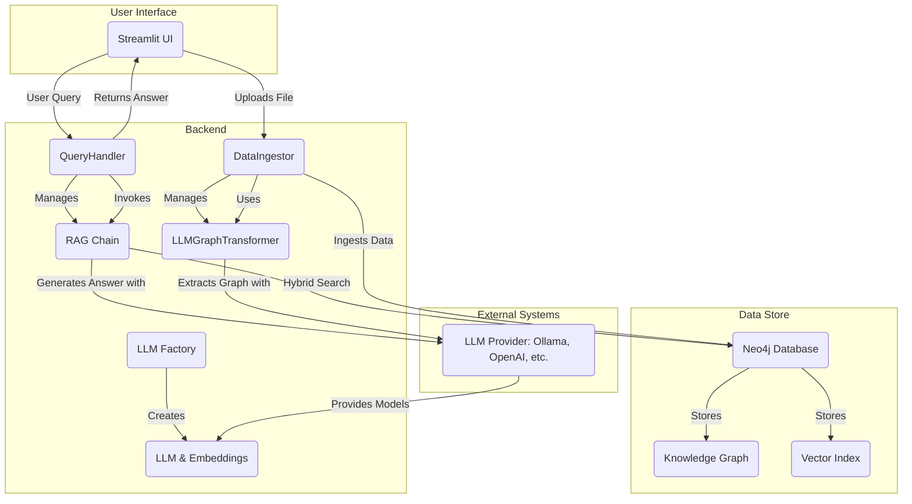

# システムアーキテクチャ (System Architecture)

本ドキュメントでは、`simple_graphrag`システムの全体的なアーキテクチャと主要コンポーネントについて説明します。特に、LLMおよび埋め込みモデルの柔軟な設定、およびグラフ検索の強化に焦点を当てます。

## 1. 全体アーキテクチャ

`simple_graphrag`システムは、主に以下の3つのフェーズで構成されます。

1.  **データインジェスト (Data Ingestion)**: 外部ドキュメントから知識グラフを構築し、ベクトルインデックスを作成するバッチ処理。
2.  **検索・応答 (Retrieval and Response)**: ユーザーのクエリに基づいて関連情報を検索し、LLMを用いて回答を生成するリアルタイム処理。
3.  **ユーザーインターフェース (User Interface)**: Streamlitを用いたチャット形式のインタフェース。

## 2. 主要コンポーネント

### 2.1. データインジェスト (`src/data_ingestion.py`)

`DataIngestor`クラスは、ドキュメントの読み込み、チャンク分割、グラフ構造への変換、およびNeo4jへの格納を担当します。

*   **LLMGraphTransformerの強化**: `LLMGraphTransformer`は、LLMを用いてドキュメントチャンクからエンティティと関係性を抽出します。本システムでは、`src/config.py`で定義された`GRAPH_ALLOWED_NODES`および`GRAPH_ALLOWED_RELATIONSHIPS`環境変数を通じて、抽出を許可するノードタイプと関係性タイプを制御できるようになりました。このスキーマ管理戦略の詳細については、[スキーマ管理ドキュメント](./SchemaManagement.md)を参照してください。これにより、抽出の精度と一貫性が向上します。

### 2.2. クエリハンドリング (`src/query_handler.py`)

`QueryHandler`クラスは、ユーザーの質問に対するハイブリッド検索（ベクトル検索とグラフ検索）をオーケストレーションし、LLMを用いて回答を生成します。

*   **GraphCypherQAChainの導入**: 従来の固定テンプレートによるCypherクエリではなく、LangChainの`GraphCypherQAChain`を導入しました。これにより、LLMがユーザーの質問とNeo4jのスキーマ情報に基づいて動的にCypherクエリを生成し、より複雑で文脈に即したグラフ検索が可能になりました。これにより、検索の柔軟性と精度が大幅に向上しています。
*   **ハイブリッド検索**: ベクトル検索（`Neo4jVector`）と`GraphCypherQAChain`によるグラフ検索の結果を統合し、LLMにコンテキストとして提供します。

### 2.3. LLMおよび埋め込みモデルの管理 (`src/llm_factory.py`, `src/config.py`)

本システムは、LLMおよび埋め込みモデルの選択において高い柔軟性を提供します。

*   **`src/config.py`**: 環境変数からLLMプロバイダー（`LLM_PROVIDER`）および関連する設定（APIキー、モデル名、エンドポイントなど）を読み込みます。サポートされるプロバイダーは、`ollama`、`openai`、`azure_openai`です。
*   **`src/llm_factory.py`**: `get_llm_and_embeddings()`関数を提供し、`src/config.py`の設定に基づいて適切なLangChainのLLM（例: `ChatOllama`, `ChatOpenAI`, `AzureChatOpenAI`）および埋め込みモデル（例: `OllamaEmbeddings`, `OpenAIEmbeddings`）のインスタンスを動的に生成します。これにより、コードを変更することなく、環境変数を切り替えるだけで異なるLLMを利用できます。

### 2.4. ユーザーインターフェース (`app.py`)

Streamlitフレームワークを使用して、ユーザーがシステムと対話するための直感的なチャットインターフェースを提供します。

*   **セッション管理**: `st.session_state`を活用して、チャット履歴や初期化されたコンポーネント（`QueryHandler`など）の状態を管理します。
*   **データ投入機能**: サイドバーからローカルのMarkdownやPDFファイルをNeo4jに投入する機能を提供します。
*   **結果表示**: LLMが生成した回答に加え、回答の根拠となった関連グラフデータ（`streamlit-agraph`で可視化）と参照ドキュメント（ベクトル検索結果）をタブ形式で表示します。

## 3. 設定と環境変数

本システムの動作は、`.env`ファイル（または環境変数）を通じて設定されます。主要な設定項目は以下の通りです。

*   **Neo4j接続情報**:
    *   `NEO4J_URI`
    *   `NEO4J_USERNAME`
    *   `NEO4J_PASSWORD`
*   **LLMプロバイダー設定**:
    *   `LLM_PROVIDER`: `ollama`, `openai`, `azure_openai`のいずれかを指定。
    *   **Ollamaの場合**:
        *   `OLLAMA_BASE_URL`
        *   `OLLAMA_MODEL`
        *   `OLLAMA_EMBEDDING_MODEL`
    *   **OpenAIの場合**:
        *   `OPENAI_API_KEY`
        *   `OPENAI_MODEL` (例: `gpt-4o-mini`)
        *   `OPENAI_EMBEDDING_MODEL` (例: `text-embedding-3-small`)
    *   **Azure OpenAIの場合**:
        *   `AZURE_OPENAI_API_KEY`
        *   `AZURE_OPENAI_ENDPOINT`
        *   `AZURE_OPENAI_API_VERSION`
        *   `AZURE_OPENAI_MODEL` (デプロイ名)
        *   `AZURE_OPENAI_EMBEDDING_MODEL` (デプロイ名)
*   **グラフ変換設定**:
    *   `GRAPH_ALLOWED_NODES`: `LLMGraphTransformer`で抽出を許可するノードタイプをカンマ区切りで指定。
    *   `GRAPH_ALLOWED_RELATIONSHIPS`: `LLMGraphTransformer`で抽出を許可する関係性タイプをカンマ区切りで指定。

これらの設定を適切に行うことで、様々な環境や要件に合わせてシステムを柔軟に運用することができます。
